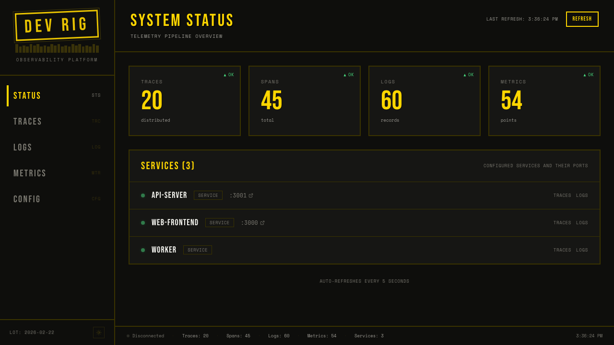
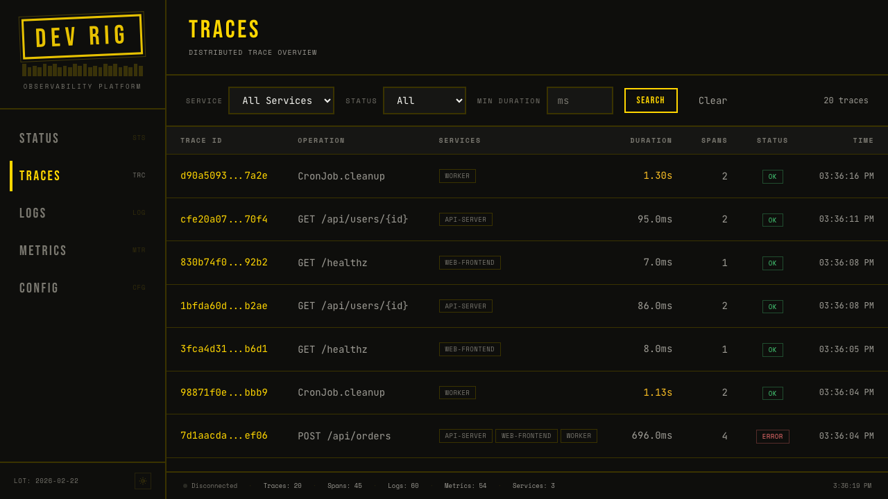
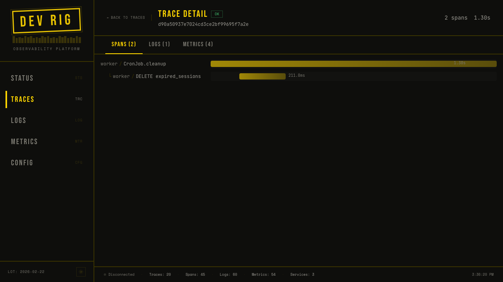
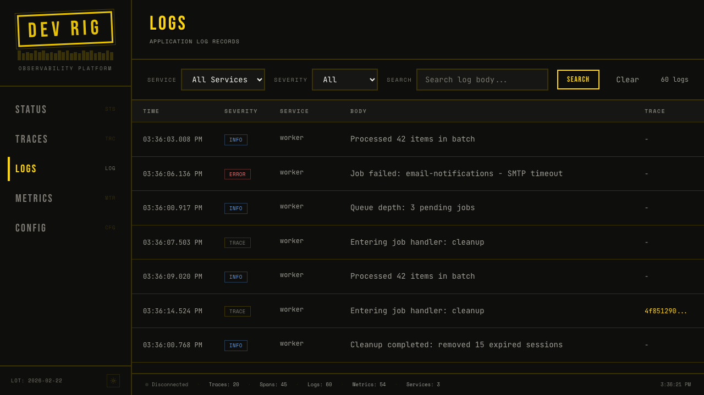
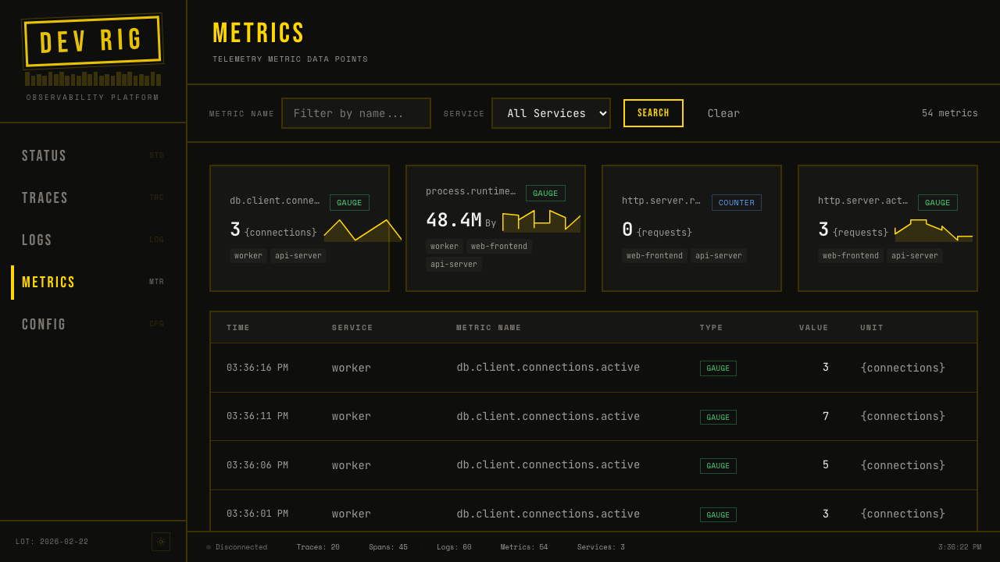

# devrig

Local development orchestrator.

## Dashboard

devrig includes a built-in observability dashboard that receives OpenTelemetry
data from your services in real time.



Drill into any trace to see the full span waterfall across services:





Browse and search application logs with severity filtering:



Explore metrics with sparkline cards and expandable time-series charts:



## What is devrig?

devrig manages your local development environment. Define your services in a
single TOML file, and devrig starts them in dependency order, multiplexes their
logs, assigns ports, and tears everything down cleanly on Ctrl+C.

## Quickstart

```bash
cargo install --path . && devrig init && devrig start
```

## Minimal example

```toml
# devrig.toml
[project]
name = "myapp"

[services.api]
command = "cargo watch -x run"
port = 3000

[services.web]
command = "npm run dev"
port = 5173
depends_on = ["api"]
```

Save as `devrig.toml` in your project root, then run `devrig start`.

## Commands

| Command         | Description                                      |
|-----------------|--------------------------------------------------|
| `devrig start`  | Start all services in dependency order            |
| `devrig stop`   | Stop all running services gracefully              |
| `devrig delete` | Stop services and remove all `.devrig/` state     |
| `devrig ps`     | Show status of services in the current project    |
| `devrig init`   | Generate a starter `devrig.toml` for your project |
| `devrig doctor` | Check that external dependencies are installed    |

### Global flags

| Flag           | Description                          |
|----------------|--------------------------------------|
| `-f <path>`    | Use a specific config file           |

## How it works

1. **Parse** -- devrig reads `devrig.toml` (or walks up the directory tree to
   find one) and validates it in two phases: TOML deserialization, then semantic
   validation (missing deps, duplicate ports, cycles).
2. **Resolve** -- A dependency graph is built with `petgraph` and
   topologically sorted to determine start order. Auto-ports are assigned by
   binding ephemeral OS ports.
3. **Supervise** -- Each service runs under a supervisor that captures
   stdout/stderr, restarts on failure with exponential backoff, and responds to
   cancellation via `CancellationToken`.
4. **Multiplex** -- All service logs stream through a shared channel to a
   `LogWriter` that color-codes output by service name.
5. **Shutdown** -- Ctrl+C triggers graceful shutdown: SIGTERM to process
   groups, 5-second grace period, then SIGKILL. State files are cleaned up.

## Project layout

```
src/
  main.rs              CLI entrypoint and command dispatch
  lib.rs               Public module declarations
  cli.rs               Clap argument definitions
  identity.rs          Project identity (name + SHA-256 slug)
  config/
    mod.rs             Config loading (TOML parse)
    model.rs           Data model (DevrigConfig, ServiceConfig, Port)
    resolve.rs         Config file discovery (walk-up search)
    validate.rs        Semantic validation (deps, ports, cycles)
  orchestrator/
    mod.rs             Orchestrator: coordinates start/stop/delete
    graph.rs           petgraph-based dependency resolution
    ports.rs           Port availability checks and auto-assignment
    registry.rs        Global instance registry (~/.devrig/instances.json)
    state.rs           Per-project state persistence (.devrig/state.json)
    supervisor.rs      Process supervision with restart and backoff
  commands/
    init.rs            Generate starter devrig.toml
    doctor.rs          Check external tool availability
    ps.rs              Display service and instance status
  ui/
    logs.rs            Multiplexed log writer with color
    summary.rs         Startup summary table
```

## Configuration reference

See [docs/guides/configuration.md](docs/guides/configuration.md) for the full
`devrig.toml` reference.

## Architecture

See [docs/architecture/overview.md](docs/architecture/overview.md) for a
system-level overview, and the [docs/adr/](docs/adr/) directory for
architectural decision records.

## Contributing

See [docs/guides/contributing.md](docs/guides/contributing.md) for development
setup and PR guidelines.

## Tech stack

- **Rust** with Tokio async runtime
- **clap** for CLI parsing
- **petgraph** for dependency resolution
- **serde** + **toml** for configuration
- **sha2** for project identity hashing
- **nix** for Unix signal handling
- **miette** / **thiserror** / **anyhow** for error reporting
- **SolidJS** + **Vite** + **Tailwind v4** for the dashboard
- **Kobalte** for accessible UI primitives
- **Lucide** for icons

## License

See LICENSE file for details.
