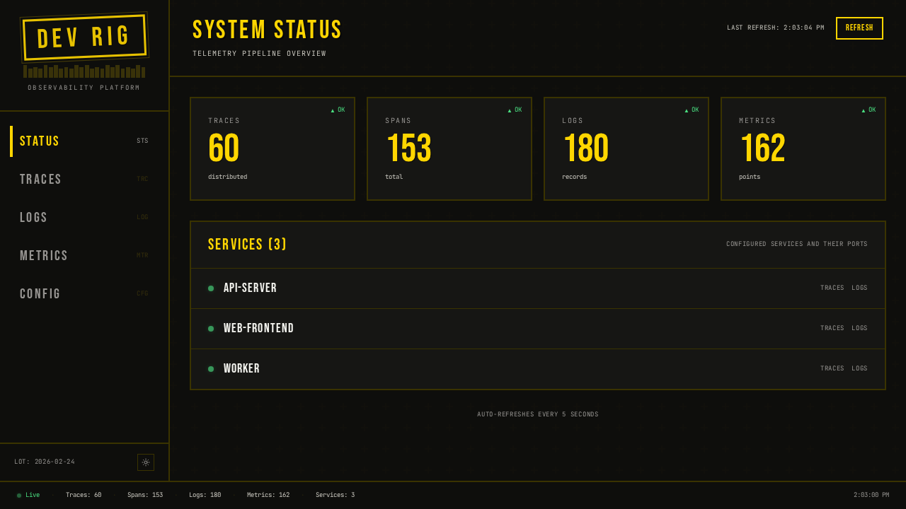
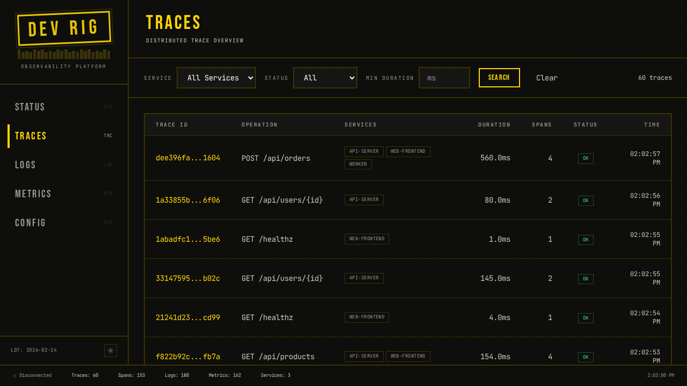
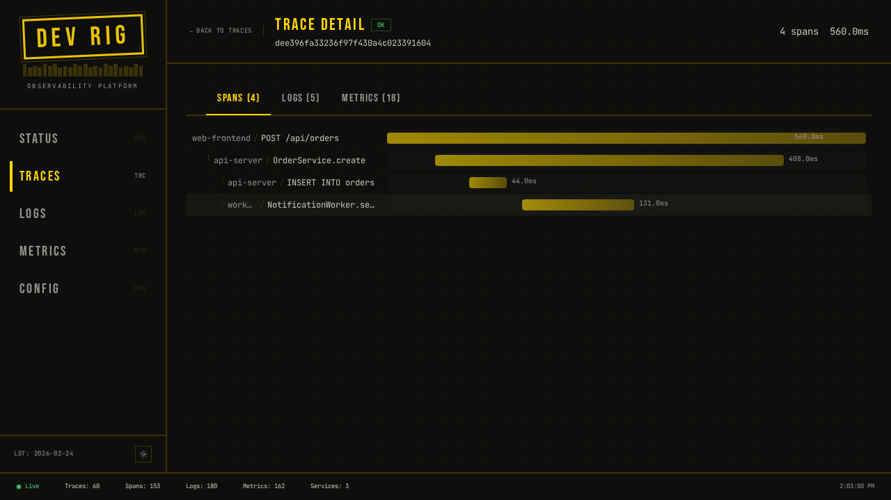
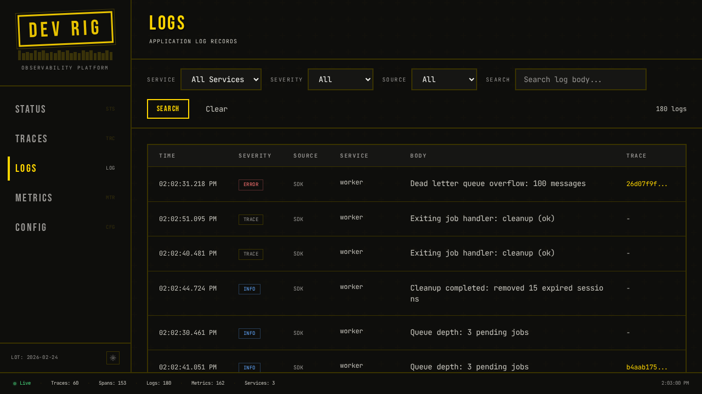
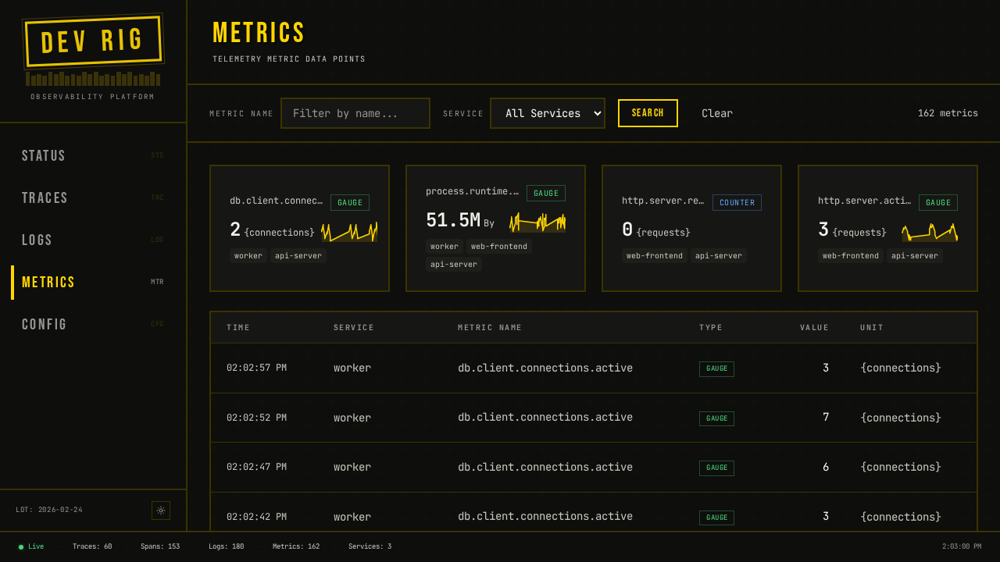

# DEV RIG

Local development orchestrator with built-in OpenTelemetry. Define your
services in a single TOML file — devrig starts them in dependency order,
multiplexes logs, manages ports, collects traces/metrics/logs, and tears
everything down cleanly on Ctrl+C.

## Dashboard

devrig includes a built-in observability dashboard that receives OpenTelemetry
data from your services in real time.



Drill into any trace to see the full span waterfall across services:





Browse and search application logs with severity filtering:



Explore metrics with sparkline cards and expandable time-series charts:



## Install

**Shell installer** (Linux/macOS) — downloads the latest release, verifies its
SHA256, and installs to `~/.local/bin`:

```bash
curl --proto '=https' --tlsv1.2 -LsSf https://github.com/steveyackey/devrig/releases/latest/download/install.sh | sh
```

**PowerShell installer** (Windows):

```powershell
powershell -ExecutionPolicy Bypass -c "irm https://github.com/steveyackey/devrig/releases/latest/download/install.ps1 | iex"
```

Both installers include the embedded dashboard. Run `devrig update` to upgrade
in place afterward.

**Prebuilt binaries** — or download the archive for your platform from the
[latest release](https://github.com/steveyackey/devrig/releases/latest) and put
`devrig` on your `PATH`.

**From source** (Go 1.26+):

```bash
go install github.com/steveyackey/devrig/cmd/devrig@latest
```

(Note: `go install` builds without the embedded dashboard UI — use an installer
or release binary for the full dashboard, or build with `-tags embedspa` after
staging `web/dist` into `internal/dashboard/dist`.)

## Quickstart

```bash
devrig init && devrig start
```

## Minimal example

```toml
# devrig.toml
[project]
name = "myapp"

[dashboard]

[services.api]
command = "go run ./cmd/api"
port = 3000

[services.web]
command = "npm run dev"
port = 5173
depends_on = ["api"]
```

Save as `devrig.toml` in your project root, then run `devrig start`.
The dashboard opens at `http://localhost:4000`.

## Commands

| Command              | Description                                      |
|----------------------|--------------------------------------------------|
| `devrig start`       | Start all services in dependency order            |
| `devrig stop`        | Stop all running services gracefully (`--all` for every project) |
| `devrig delete`      | Stop services and remove all `.devrig/` state (`--all` for every project) |
| `devrig ps`          | Show status of services in the current project    |
| `devrig init`        | Generate a starter `devrig.toml` for your project |
| `devrig doctor`      | Check dependencies; show managed/system tool resolution |
| `devrig deps`        | Manage pinned k3d/kubectl/helm (`list`/`install`/`update`) |
| `devrig validate`    | Validate the configuration file                   |
| `devrig logs`        | Show and filter service logs                      |
| `devrig env`         | Show resolved environment variables for a service |
| `devrig exec`        | Execute a command in a docker container            |
| `devrig query`       | Query traces, logs, and metrics from the OTel collector |
| `devrig cluster`     | Manage the k3d cluster (create/delete/kubeconfig) |
| `devrig kubectl`     | Proxy to kubectl with devrig's isolated kubeconfig |
| `devrig update`      | Update devrig to the latest version               |
| `devrig completions` | Generate shell completions                        |

### Global flags

| Flag           | Description                          |
|----------------|--------------------------------------|
| `-f <path>`    | Use a specific config file           |

## How it works

1. **Parse** — reads `devrig.toml` (or walks up to find one), validates in two
   phases: TOML deserialization, then semantic checks (missing deps, duplicate
   ports, cycles).
2. **Resolve** — builds a dependency graph with `petgraph` and topologically
   sorts it. Docker containers, k3d cluster deployments, and services can all
   depend on each other. Auto-ports are assigned by binding ephemeral OS ports.
3. **Docker** — pulls and starts Docker containers for databases, caches, and
   other infrastructure. Supports health checks, init commands, and volume
   mounts.
4. **Cluster** — optionally creates a k3d cluster, deploys manifests, and
   installs Helm chart addons with port forwarding.
5. **Supervise** — each service runs under a supervisor that captures
   stdout/stderr, restarts on failure with exponential backoff, and responds to
   cancellation.
6. **Observe** — a built-in OTel collector receives traces, metrics, and logs
   over OTLP (HTTP :4318 / gRPC :4317) and serves them to the dashboard and
   CLI query commands.
7. **Dashboard** — an embedded Vue app on :4000 provides real-time views
   of service status, traces, logs, and metrics.
8. **Shutdown** — Ctrl+C triggers graceful shutdown: SIGTERM to process groups,
   grace period, then SIGKILL. Containers and state are cleaned up.

## Tech stack

- **Go** (goroutines + channels for orchestration)
- **cobra** for CLI parsing
- **BurntSushi/toml** + **yaml.v3** for configuration
- **docker/docker** client for container management
- **grpc-go** + **opentelemetry-proto** for OTLP ingest
- **net/http** for the dashboard API and WebSocket server (nhooyr.io/websocket)
- **go:embed** for compiled-in frontend assets
- **yauth** for the built-in OIDC provider
- **Vue 3** + **Vite** + **Tailwind v4** for the dashboard

## Documentation

- [Configuration reference](docs/guides/configuration.md)
- [Architecture overview](docs/architecture/overview.md)
- [Architectural decision records](docs/adr/)
- [Contributing](docs/guides/contributing.md)

## License

MIT — see [LICENSE](LICENSE) for details.
